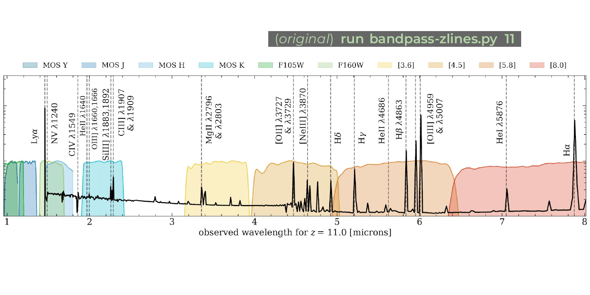

# variations on zlines

This repository is a series of variations on the zlines code I created to help with telescope observing proposals during graduate school, before the beautiful JWST launched into space.  You can find in [Quick Tools for the Observational Astronomer](https://github.com/aibhleog/Quick-Tools-for-the-Observational-Astronomer) and the `bandpass-zlines` folder in [Plotting Playground](https://github.com/aibhleog/plotting-playground).





There are three versions of the code in this repository, described as follows:

* `bandpass-zlines.py` -- the original script, included for completeness
* `bandpass-zlines-withjwstspec.py` -- mimics the original script, but includes a bottom subplot that shows general coverage of the spectroscopic modes for each of the four JWST instruments
* `bandpass-zlines-jwstonly.py` -- a JWST-only version of the script, which has an additional kwarg option to toggle between the spectroscopic coverage vs the photometric coverage for all instruments

To run any of these scripts, you can put the following in your terminal (replacing the script name with whichever of the three you prefer):

```
run bandpass-zlines.py 7
```

The number indicates the redshift that the model spectrum &amp; lines will be shifted to.  If you want to see the photometric coverage at that redshift using the `bandpass-zlines-jwstonly.py` script, you simply add "phot" to the end of that line:

```
run bandpass-zlines-jwstonly.py 7 phot
```


### other files in repo
The other scripts in this repo are imported into the bandpass ones.  The other files and folders are used in plotting. I'll describe their uses below:

* `add_lines.py` -- this script is a continuing work in progress, but once imported it essentially it uses a dictionary of lines and plots them with notations onto a plot (eventually I'll make it less chaotic, but for now it works)
* `igm_absorption.py` -- this takes a spectrum and a redshift and applies IGM attenuation (such that at higher redshifts you start to see the dampening of light bluewards of Lyman-alpha (1216 angstroms)
* `filters.py` -- this chaos script sorts &amp; organizes the various ground- and space-based bandpasses plotted in the three bandpass scripts.
* `filters/` -- this folder contains all of the filters used in the three bandpass scripts, with all but the Keck/MOSFIRE ones pulled from the [SVO filter profile service](http://svo2.cab.inta-csic.es/svo/theory/fps3/) for consistency in formatting (the Keck/MOSFIRE ones are pulled from the MOSFIRE instrument webpage)
* `age7z0.2zneb0.2u-2.1_100.con` -- this is a Cloudy model that I created which used a BPASS single stellar population model (10 Myr, max mass 100 Msolar) and defined the nebular gas to be 20% Solar with n_H = 300 cm^(-3) and ionization parameter of logU = -2.1 (you're welcome to replace this model with one of your own).


